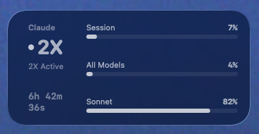

# Claude Usage macOS Widget

A native macOS desktop widget that shows your Claude plan usage limits and 2X rate promotion status in real time.



## What it shows

**Plan Usage Limits** (pulled from your Claude subscription):
- Current session utilization (5-hour rolling window)
- Weekly all-models usage
- Weekly Sonnet-specific usage

**2X Rate Status** (March 13-27, 2026 promotion):
- Whether 2X limits are currently active
- Countdown to next state change
- Peak hours indicator (Mon-Fri 8am-2pm ET = standard rates)

## Requirements

- macOS 15.0+
- Xcode 16.0+ (to build)
- [XcodeGen](https://github.com/yonaskolb/XcodeGen) (`brew install xcodegen`)
- Claude Code installed and logged in (the widget reads your OAuth token from the Keychain)

## Setup

### 1. Clone and generate the Xcode project

```bash
git clone https://github.com/0xPotatoofdoom/claude-usage-macos-widget.git
cd claude-usage-macos-widget
xcodegen generate
```

### 2. Configure signing

Find your Apple Developer Team ID:

```bash
security find-certificate -c "Apple Development" -p ~/Library/Keychains/login.keychain-db | openssl x509 -noout -subject
```

Look for the `OU=` field (e.g. `OU=ABC123XYZ`). Then replace `YOUR_TEAM_ID` with it across the project:

```bash
# macOS/Linux
sed -i '' "s/YOUR_TEAM_ID/ABC123XYZ/g" project.yml Shared/UsageStats.swift ClaudeThrottle/ClaudeThrottle.entitlements ClaudeThrottleWidget/ClaudeThrottleWidget.entitlements
```

This sets the signing team and App Group IDs in all the right places.

### 3. Build and install

```bash
xcodegen generate

xcodebuild -project ClaudeThrottle.xcodeproj \
  -scheme ClaudeThrottle -configuration Debug \
  DEVELOPMENT_TEAM=YOUR_TEAM_ID \
  CODE_SIGN_STYLE=Automatic \
  CODE_SIGN_IDENTITY="Apple Development" \
  clean build

# Copy to Applications
cp -R ~/Library/Developer/Xcode/DerivedData/ClaudeThrottle-*/Build/Products/Debug/ClaudeThrottle.app /Applications/

# Register with the system
/System/Library/Frameworks/CoreServices.framework/Versions/Current/Frameworks/LaunchServices.framework/Versions/Current/Support/lsregister -f -R -trusted /Applications/ClaudeThrottle.app

# Launch
open /Applications/ClaudeThrottle.app
```

### 4. Add the widget

1. Right-click your desktop and select **Edit Widgets**
2. Search for **"Claude"**
3. Drag the small or medium widget to your desktop

## How it works

The widget reads your Claude Code OAuth token from the macOS Keychain (`Claude Code-credentials`) and calls `https://api.anthropic.com/api/oauth/usage` to fetch your current plan utilization. This is the same endpoint that powers the usage display in the Claude app.

The 2X promotion status is calculated locally based on Anthropic's announced schedule (off-peak = weekday evenings/nights + weekends during the promotion period).

The widget refreshes every 5 minutes or at rate state transitions, whichever comes first.

## Project structure

```
project.yml                    # XcodeGen project spec
Shared/
  ThrottleStatus.swift         # 2X rate promotion calculator
  UsageStats.swift             # OAuth usage fetcher + shared data store
ClaudeThrottle/
  ClaudeThrottleApp.swift      # Main app (config UI)
ClaudeThrottleWidget/
  ClaudeThrottleWidget.swift   # Widget views + timeline provider
  ClaudeThrottleWidgetBundle.swift
```

## Notes

- The usage API endpoint is undocumented/internal. It may change without notice.
- Free Apple Developer accounts work fine for local builds.
- The widget extension requires App Sandbox entitlements to be discovered by macOS.
- If the widget doesn't appear in the gallery, make sure the app has been launched at least once.

## License

MIT
